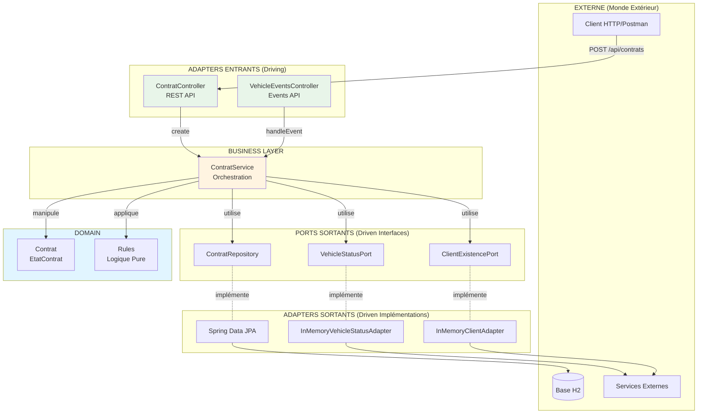

# BFB Management System

Vehicle rental management system - Spring Boot 3.5.7, Java 17, DDD/TDD approach.

## Quick Start

```bash
cd demo
./mvnw spring-boot:run  # http://localhost:8080
./mvnw test             # Run 130+ tests
```

## Architecture

```
business/       → Domain logic (framework-agnostic)
infrastructure/ → JPA repositories
interfaces/rest/→ REST API controllers
```

## Stack

- Spring Boot 3.5.7, Java 17
- H2 (dev), PostgreSQL (prod)
- Hibernate + JPA, Flyway
- MapStruct, JUnit 5, Mockito
- SpringDoc OpenAPI

## API

- `POST /api/contracts` - Create contract
- `GET /api/contracts/{id}` - Get contract
- `PATCH /api/contracts/{id}/status` - Update status
- `POST /api/clients` - Create client
- `GET /api/clients/{id}` - Get client
- `POST /api/vehicles` - Create vehicle
- `GET /api/vehicles/{id}` - Get vehicle

Swagger: http://localhost:8080/swagger-ui.html

## Patterns

- Chain of Responsibility (validation)
- State Pattern (contract status)
- Repository Pattern
- Value Objects (Period, Email)

## Documentation

- [Design Patterns](docs/GUIDE_4_DESIGN_PATTERNS.md)
- [Stack Evolution](docs/GUIDE_5_STACK_TECHNIQUE.md)
- [Database Journey](docs/GUIDE_3_DATABASE_JOURNEY.md)
- [Architecture](docs/GUIDE_2_ARCHITECTURE_EVOLUTION.md)
- [Tech Report](RAPPORT_TECH_LEAD.md)

## Team

Tech Lead: Saad | Developers: Vulzyun, Mohamedlam, Xaymaa
│
├── 🟨 business.contrats/                 # ❷ SERVICES + PORTS
│   ├── ContratService.java               # Orchestration métier
│   │
│   ├── ports/                            # PORTS SORTANTS
│   │   ├── VehicleStatusPort.java        # Interface (port)
│   │   └── ClientExistencePort.java      # Interface (port)
│   │
│   ├── adapters/                         # ADAPTERS SORTANTS
│   │   ├── InMemoryVehicleStatusAdapter.java  # Implémentation
│   │   └── InMemoryClientAdapter.java         # Implémentation
│   │
│   └── exceptions/                       # Exceptions métier
│       ├── ValidationException.java
│       ├── OverlapException.java
│       └── ...
│
└── 🟩 presentation.contrats/             # ❸ ADAPTERS ENTRANTS
    ├── ContratController.java            # REST API
    ├── VehicleEventsController.java      # Events API
    ├── CreateContratDto.java             # DTO entrée
    ├── ContratDto.java                   # DTO sortie
    ├── ContratMapper.java                # Conversion
    └── GlobalExceptionHandler.java       # Erreurs HTTP
```

---

## 🎯 Exemple Concret : Flux "Créer un Contrat"

### 📊 Diagramme de Flux

```
┌─────────────┐
│   CLIENT    │ (Postman, Frontend)
└──────┬──────┘
       │ POST /api/contrats
       ▼
┌─────────────────────────────────────────┐
│  🟩 ADAPTER ENTRANT                      │
│  ContratController.create()             │

┌─────────────────────────────────────────┐
│  🟨 SERVICE MÉTIER                       │
│  ContratService.create()                │
│  1. Valide dateDebut < dateFin          │
│  2. Vérifie client existe               │
│  3. Vérifie véhicule disponible         │
│  4. Vérifie pas de chevauchement        │
│  5. Crée le contrat                     │
└──────┬──────────────────────────────────┘
       │
       ├─► clientExistencePort.existsById()
       │   (PORT SORTANT)
       │         ▼
       │   ┌──────────────────────────────┐
       │   │ InMemoryClientAdapter        │
       │   │ (ADAPTER SORTANT - stub)     │
       │   └──────────────────────────────┘
       │
       ├─► vehicleStatusPort.getStatus()
       │   (PORT SORTANT)
       │         ▼
       │   ┌──────────────────────────────┐
       │   │ InMemoryVehicleStatusAdapter │
       │   │ (ADAPTER SORTANT - stub)     │
       │   └──────────────────────────────┘
       │
       └─► contratRepository.save()
           (PORT SORTANT)
                 ▼
           ┌──────────────────────────────┐
           │ Spring Data JPA Repository   │
           │ (ADAPTER SORTANT - JPA)      │
           └──────────────────────────────┘
                 ▼
           ┌──────────────────────────────┐
           │     Base de données H2       │
           └──────────────────────────────┘
```

---

## 💻 Code Détaillé : Analyse Ligne par Ligne

### 🟦 1. DOMAINE : Logique Métier Pure 

Read [](file:///c%3A/Users/QL6479/SchoolDevs/BFBArchitecture/demo/src/main/java/com/BFBManagement/infrastructure/contrats/domain/Rules.java)

**🎓 Analyse de Rules.java :**

```java
// ✅ PARFAIT : Logique métier PURE
// ❌ Aucune dépendance à Spring
// ❌ Aucune dépendance à JPA
// ❌ Aucune dépendance à HTTP
// ✅ Utilise uniquement Java standard (LocalDate, Set)
// ✅ Testable sans contexte externe
```

**Pourquoi c'est du domaine pur ?**
- Peut être testé **sans Spring Boot**
- Peut être réutilisé dans un projet **JavaFX**, **Android**, **CLI**
- Les règles métier ne changeront pas si vous passez de H2 à PostgreSQL
- Les règles métier ne changeront pas si vous passez de REST à GraphQL

---

### 🟨 2. PORTS : Les Interfaces de Communication 

Read [](file:///c%3A/Users/QL6479/SchoolDevs/BFBArchitecture/demo/src/main/java/com/BFBManagement/business/contrats/ports/VehicleStatusPort.java)

Read [](file:///c%3A/Users/QL6479/SchoolDevs/BFBArchitecture/demo/src/main/java/com/BFBManagement/business/contrats/ports/ClientExistencePort.java)

**🎓 Analyse des Ports :**

```java
// ✅ Ce sont des INTERFACES (contrats)
// ✅ Définies par le DOMAINE pour ses besoins
// ✅ Le domaine ne sait PAS comment elles sont implémentées
// ✅ Principe d'Inversion de Dépendance (Dependency Inversion)

// 🔥 AVANT (Couplage fort - MAUVAIS) :
public class ContratService {
    private VehicleService vehicleService; // Dépendance concrète
    
    public void create(...) {
        Vehicle vehicle = vehicleService.findById(...); // Couplage
    }
}

// ✅ APRÈS (Architecture Hexagonale - BON) :
public class ContratService {
    private VehicleStatusPort vehiclePort; // Dépendance abstraite
    
    public void create(...) {
        EtatVehicule status = vehiclePort.getStatus(...); // Découplé
    }
}
```

**Avantages :**
1. **Testabilité** : Dans les tests, vous utilisez un **mock** du port
2. **Flexibilité** : L'implémentation peut être :
   - Base de données
   - API HTTP
   - Cache Redis
   - Service gRPC
   - Stub en mémoire (développement)

---

### 🟩 3. ADAPTERS : Les Implémentations Concrètes

#### Adapter Sortant (Driven) - Stub 

Read [](file:///c%3A/Users/QL6479/SchoolDevs/BFBArchitecture/demo/src/main/java/com/BFBManagement/business/contrats/adapters/InMemoryVehicleStatusAdapter.java)

**🎓 Analyse de l'Adapter :**

```java
// ✅ IMPLÉMENTE le port (interface)
// ✅ Annotation @Component pour Spring (injection)
// ⚠️  C'est un STUB (implementation temporaire)
// 🔮 Peut être remplacé par une vraie implémentation :

@Component
public class HttpVehicleStatusAdapter implements VehicleStatusPort {
    private final RestTemplate restTemplate;
    
    @Override
    public EtatVehicule getStatus(UUID vehiculeId) {
        // Appel HTTP vers le microservice Véhicules
        String url = "http://vehicle-service/api/vehicules/" + vehiculeId;
        VehicleDto dto = restTemplate.getForObject(url, VehicleDto.class);
        return dto.getEtat();
    }
}

// 🎯 LE DOMAINE N'A PAS BESOIN D'ÊTRE MODIFIÉ !
// Spring injectera automatiquement le nouvel adapter
```

#### Adapter Entrant (Driving) - REST Controller

Regardons votre `ContratController` :

```java
@RestController
@RequestMapping("/api/contrats")
public class ContratController {

    private final ContratService contratService; // ❶ Dépendance au SERVICE
    private final ContratMapper contratMapper;   // ❷ Mapper DTO

    // ❸ Injection par constructeur
    public ContratController(ContratService contratService, 
                             ContratMapper contratMapper) {
        this.contratService = contratService;
        this.contratMapper = contratMapper;
    }

    @PostMapping
    public ResponseEntity<ContratDto> create(@Valid @RequestBody CreateContratDto dto) {
        // ❹ Le Controller est un ADAPTER ENTRANT
        // Il transforme HTTP → Appels métier
        
        Contrat contrat = contratService.create(
            dto.clientId(),
            dto.vehiculeId(),
            dto.dateDebut(),
            dto.dateFin()
        );
        
        // ❺ Transforme l'entité en DTO pour la réponse
        return ResponseEntity
            .status(HttpStatus.CREATED)
            .body(contratMapper.toDto(contrat));
    }
}
```

**🎯 Responsabilités du Controller (Adapter Entrant) :**
1. **Recevoir** les requêtes HTTP
2. **Valider** les données d'entrée (`@Valid`)
3. **Déléguer** au service métier
4. **Transformer** la réponse (Entity → DTO)
5. **Gérer** les codes HTTP (201, 400, etc.)

---

## 🔥 Le Principe d'Inversion de Dépendance (DIP)

### ❌ Architecture Traditionnelle (Mauvaise)

```
┌─────────────┐
│ Controller  │
└──────┬──────┘
       │ dépend de ↓
┌──────▼──────┐
│   Service   │
└──────┬──────┘
       │ dépend de ↓
┌──────▼──────────┐
│  VehicleService │  ← Dépendance concrète
│  (Autre module) │
└─────────────────┘

❌ Problème : Le Service dépend d'une IMPLÉMENTATION concrète
❌ Si VehicleService change, le Service casse
❌ Impossible de tester sans VehicleService
```

### ✅ Architecture Hexagonale (Bonne)

```
┌─────────────┐
│ Controller  │
└──────┬──────┘
       │ dépend de ↓
┌──────▼──────────────────┐
│   Service               │
│   (dépend d'interfaces) │
└──────┬──────────────────┘
       │ dépend de ↓
┌──────▼────────────────┐
│ VehicleStatusPort     │  ← INTERFACE
│      (Port)           │
└───────────────────────┘
       ▲ implémente
       │
┌──────┴────────────────┐
│ VehicleStatusAdapter  │  ← IMPLÉMENTATION
│  (Remplaçable)        │
└───────────────────────┘

✅ Le Service dépend d'une ABSTRACTION (port)
✅ L'adapter peut être changé sans impacter le Service
✅ Facile à tester avec des mocks
```

---

## 🧪 Testabilité : Le Superpouvoir de l'Archi Hexagonale

### Exemple de Test Unitaire SANS Spring 

Read [](file:///c%3A/Users/QL6479/SchoolDevs/BFBArchitecture/demo/src/test/java/com/BFBManagement/business/contrats/ContratServiceTest.java#1-1), lines 1 to 81

**🎓 Analyse du Test :**

```java
@ExtendWith(MockitoExtension.class)  // ❶ Mockito uniquement, PAS de Spring !
class ContratServiceTest {

    @Mock
    private ContratRepository contratRepository;     // ❷ Mock du port
    
    @Mock
    private VehicleStatusPort vehicleStatusPort;     // ❸ Mock du port
    
    @Mock
    private ClientExistencePort clientExistencePort; // ❹ Mock du port

    @InjectMocks
    private ContratService contratService;           // ❺ Service sous test

    @Test
    void create_refuses_whenVehicleIsDown() {
        // ❻ On simule le comportement du port
        when(vehicleStatusPort.getStatus(vehiculeId))
            .thenReturn(EtatVehicule.EN_PANNE);

        // ❼ Test de la logique métier
        assertThrows(VehicleUnavailableException.class, () -> 
            contratService.create(...)
        );
    }
}
```

**🔥 Avantages :**
- ✅ Test en **millisecondes** (pas de Spring Boot à démarrer)
- ✅ Pas de base de données nécessaire
- ✅ Pas de serveur HTTP
- ✅ **Isolation parfaite** du service métier
- ✅ Contrôle total sur le comportement des dépendances

---

## 📊 Comparaison : Architecture Traditionnelle vs Hexagonale

| Aspect | 🔴 Architecture en Couches | 🟢 Architecture Hexagonale |
|--------|---------------------------|---------------------------|
| **Dépendances** | Controller → Service → Repository | Service dépend de PORTS (abstractions) |
| **Testabilité** | Tests nécessitent Spring | Tests unitaires PURS (Mockito seul) |
| **Flexibilité** | Changement = modification code | Changement = nouveau adapter |
| **Couplage** | Fort (implémentations concrètes) | Faible (interfaces) |
| **Maintenance** | Difficile si changement techno | Facile (domaine stable) |
| **Vitesse tests** | Lent (contexte Spring) | Rapide (pas de contexte) |
| **Complexité** | Simple pour petits projets | Plus de fichiers/interfaces |
| **Évolutivité** | Rigide | Flexible |

---

## 🎯 Les Bénéfices Concrets dans VOTRE Projet

### 1️⃣ **Changement de Base de Données**

```java
// AVANT : H2 (développement)
@Repository
public interface ContratRepository extends JpaRepository<Contrat, UUID> { ... }

// APRÈS : PostgreSQL (production)
// ❌ Aucun changement dans ContratService nécessaire !
// ✅ Juste changer la configuration application.yml
spring:
  datasource:
    url: jdbc:postgresql://localhost:5432/bfb
```

### 2️⃣ **Intégration d'un Microservice Véhicules**

```java
// 🔄 Remplacer l'adapter stub :

// AVANT (stub)
@Component
public class InMemoryVehicleStatusAdapter implements VehicleStatusPort {
    public EtatVehicule getStatus(UUID id) {
        return EtatVehicule.DISPONIBLE; // Toujours disponible
    }
}

// APRÈS (vrai service)
@Component
@Primary  // Pour remplacer le stub
public class RestVehicleStatusAdapter implements VehicleStatusPort {
    private final RestTemplate restTemplate;
    
    public EtatVehicule getStatus(UUID id) {
        String url = "http://vehicle-service:8081/api/vehicules/" + id;
        VehicleDto dto = restTemplate.getForObject(url, VehicleDto.class);
        return dto.getEtat();
    }
}

// ❌ Aucune modification dans ContratService !
// ❌ Aucune modification dans ContratController !
// ✅ Spring injecte automatiquement le nouvel adapter
```

### 3️⃣ **Ajout d'une Interface GraphQL**

```java
// Actuellement : REST seulement
@RestController
@RequestMapping("/api/contrats")
public class ContratController { ... }

// Ajouter GraphQL : nouveau adapter !
@Controller
public class ContratGraphQLResolver {
    private final ContratService contratService; // Même service !
    
    @QueryMapping
    public Contrat contratById(@Argument UUID id) {
        return contratService.findById(id);
    }
    
    @MutationMapping
    public Contrat createContrat(@Argument CreateContratInput input) {
        return contratService.create(
            input.clientId(),
            input.vehiculeId(),
            input.dateDebut(),
            input.dateFin()
        );
    }
}

// ✅ Le domaine métier reste inchangé
// ✅ Juste un nouvel adapter entrant
```

---

## 📝 Les Patterns Utilisés dans Votre Projet

### 1. **Dependency Inversion Principle (DIP)**

```java
// ✅ Principe SOLID
// Le service dépend d'abstractions, pas d'implémentations

public class ContratService {
    // ❌ PAS ça :
    // private ContratRepositoryJpa repository;
    // private HttpVehicleClient vehicleClient;
    
    // ✅ Mais ça :
    private final ContratRepository repository;        // Interface
    private final VehicleStatusPort vehiclePort;       // Interface
    private final ClientExistencePort clientPort;      // Interface
}
```

### 2. **Adapter Pattern**

```java
// Le pattern Adapter convertit une interface en une autre

// Port (interface attendue par le domaine)
public interface VehicleStatusPort {
    EtatVehicule getStatus(UUID id);
}

// Adapter (convertit l'API externe vers le port)
public class RestVehicleStatusAdapter implements VehicleStatusPort {
    private final RestTemplate restTemplate;
    
    public EtatVehicule getStatus(UUID id) {
        // Conversion : API externe → Port du domaine
        VehicleDto dto = restTemplate.getForObject(...);
        return convertToEtat(dto.getStatus());
    }
}
```

### 3. **Strategy Pattern**

```java
// Les adapters sont des stratégies interchangeables

// Stratégie 1 : Stub (développement)
@Component
@Profile("dev")
public class InMemoryVehicleStatusAdapter implements VehicleStatusPort { ... }

// Stratégie 2 : HTTP (production)
@Component
@Profile("prod")
public class RestVehicleStatusAdapter implements VehicleStatusPort { ... }

// Stratégie 3 : Cache (optimisation)
@Component
@Profile("cached")
public class CachedVehicleStatusAdapter implements VehicleStatusPort {
    private final VehicleStatusPort delegate;
    private final Cache cache;
    
    public EtatVehicule getStatus(UUID id) {
        return cache.get(id, () -> delegate.getStatus(id));
    }
}
```

---

## 🎨 Diagramme Complet de Votre Architecture



---

## 🚀 Exercice Pratique : Créer un Nouvel Adapter

Imaginons que vous voulez ajouter un **cache Redis** pour les véhicules :

### Étape 1 : Créer l'Adapter

```java
package com.BFBManagement.business.contrats.adapters;

import com.BFBManagement.business.contrats.ports.VehicleStatusPort;
import com.BFBManagement.business.vehicules.EtatVehicule;
import org.springframework.cache.annotation.Cacheable;
import org.springframework.context.annotation.Primary;
import org.springframework.stereotype.Component;

import java.util.UUID;

@Component
@Primary  // Priorité sur l'adapter In-Memory
public class CachedVehicleStatusAdapter implements VehicleStatusPort {
    
    private final VehicleStatusPort delegate;  // Délégation au vrai adapter
    
    public CachedVehicleStatusAdapter(
            InMemoryVehicleStatusAdapter inMemoryAdapter) {
        this.delegate = inMemoryAdapter;
    }
    
    @Override
    @Cacheable("vehicle-status")  // Cache Redis
    public EtatVehicule getStatus(UUID vehiculeId) {
        // Si en cache → retour immédiat
        // Sinon → délégation + mise en cache
        return delegate.getStatus(vehiculeId);
    }
}
```

### Étape 2 : Configuration Redis

```yaml
# application.yml
spring:
  cache:
    type: redis
  redis:
    host: localhost
    port: 6379
```

### Étape 3 : Dépendance Maven

```xml
<dependency>
    <groupId>org.springframework.boot</groupId>
    <artifactId>spring-boot-starter-data-redis</artifactId>
</dependency>
<dependency>
    <groupId>org.springframework.boot</groupId>
    <artifactId>spring-boot-starter-cache</artifactId>
</dependency>
```

### ✅ Résultat

- ❌ **Aucune modification** dans `ContratService`
- ❌ **Aucune modification** dans `ContratController`
- ❌ **Aucune modification** dans les tests
- ✅ Juste un **nouvel adapter** avec `@Primary`

---

## 📚 Concepts Avancés

### 1. **Bounded Context (DDD)**

Votre projet sépare les domaines :
- **Domaine Contrats** : Gestion des locations
- **Domaine Véhicules** : Gestion de la flotte
- **Domaine Clients** : Gestion des utilisateurs

Les ports permettent la communication **sans couplage**.

### 2. **Anti-Corruption Layer (ACL)**

Les adapters servent d'**Anti-Corruption Layer** :

```java
// Si l'API externe change, seul l'adapter est modifié

// API Externe v1
class VehicleApiV1 {
    String status; // "available", "down", "rented"
}

// API Externe v2 (changement !)
class VehicleApiV2 {
    int statusCode; // 1=disponible, 2=panne, 3=loué
}

// Adapter protège le domaine
public class RestVehicleStatusAdapter implements VehicleStatusPort {
    public EtatVehicule getStatus(UUID id) {
        // Conversion API externe → Domaine
        VehicleApiV2 dto = fetchFromApi(id);
        return switch (dto.statusCode) {
            case 1 -> EtatVehicule.DISPONIBLE;
            case 2 -> EtatVehicule.EN_PANNE;
            case 3 -> EtatVehicule.LOUE;
            default -> throw new IllegalStateException();
        };
    }
}

// ✅ Le domaine reste stable malgré le changement externe
```

### 3. **CQRS Pattern (potentiel)**

Vous pourriez séparer les ports en **Command** et **Query** :

```java
// Ports de commande (écriture)
public interface ContratCommandPort {
    Contrat create(...);
    Contrat start(UUID id);
    Contrat terminate(UUID id);
}

// Ports de requête (lecture)
public interface ContratQueryPort {
    Contrat findById(UUID id);
    List<Contrat> search(...);
}
```

---

## 🎯 Résumé des Apprentissages

### ✅ Ce que vous avez appris :

1. **Architecture Hexagonale** = Isoler le domaine métier
2. **Ports** = Interfaces définies par le domaine
3. **Adapters** = Implémentations techniques interchangeables
4. **DIP** = Dépendre d'abstractions, pas d'implémentations
5. **Testabilité** = Tests unitaires purs sans infrastructure
6. **Flexibilité** = Changer la technique sans toucher au métier
7. **Maintenabilité** = Code stable et évolutif

### 🎓 Votre Projet Illustre :

- ✅ **Domaine pur** : Rules.java (aucune dépendance)
- ✅ **Ports sortants** : `VehicleStatusPort`, `ClientExistencePort`
- ✅ **Adapters sortants** : `InMemoryVehicleStatusAdapter`, JPA Repository
- ✅ **Adapters entrants** : `ContratController`, `VehicleEventsController`
- ✅ **Service métier** : `ContratService` (dépend des ports)
- ✅ **Tests purs** : Mockito seul, pas de Spring

### 🚀 Prochaines Étapes :

1. Remplacer les stubs par de vrais adapters HTTP
2. Ajouter un adapter GraphQL
3. Implémenter un cache Redis
4. Créer des adapters pour différents environnements (dev/prod)
5. Ajouter des métriques dans les adapters

---

## 📖 Ressources pour Aller Plus Loin

1. **Article original** : [Hexagonal Architecture - Alistair Cockburn](https://alistair.cockburn.us/hexagonal-architecture/)
2. **Clean Architecture** : Robert C. Martin (Uncle Bob)
3. **Domain-Driven Design** : Eric Evans
4. **SOLID Principles** : Dependency Inversion Principle
5. **Votre ADR-001** : Excellente documentation dans votre projet !

---

**🎉 Félicitations !** Vous maîtrisez maintenant l'Architecture Hexagonale et pouvez expliquer comment elle est parfaitement implémentée dans votre projet BFBManagement !
