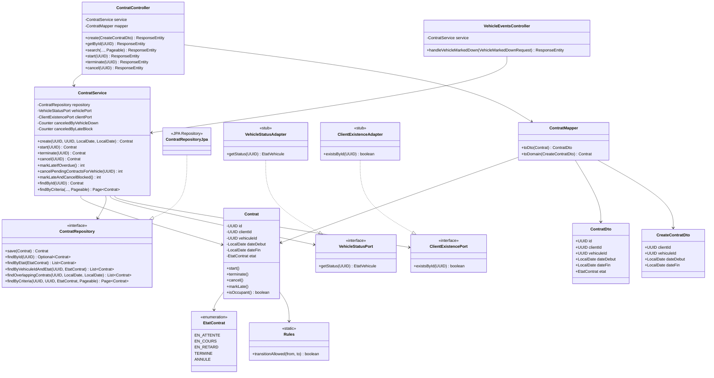

# Diagramme de Classes - Module Contrats

Ce diagramme présente l'architecture hexagonale du module de gestion des contrats.

## Légende

- **Domain Layer** : Contrat, EtatContrat, Rules (logique métier pure)
- **Ports** : Interfaces définissant les besoins du domaine
- **Business Layer** : ContratService (orchestration et règles métier)
- **Adapters** : Implémentations concrètes des ports (JPA, stubs)
- **Presentation** : Controllers REST et DTOs

## Principes appliqués

1. **Hexagonal Architecture** : Le domaine ne dépend que de ses ports
2. **Dependency Inversion** : Les adapters implémentent les interfaces du domaine
3. **Single Responsibility** : Chaque classe a une responsabilité unique
4. **Clean Architecture** : Séparation claire des couches avec dépendances unidirectionnelles
