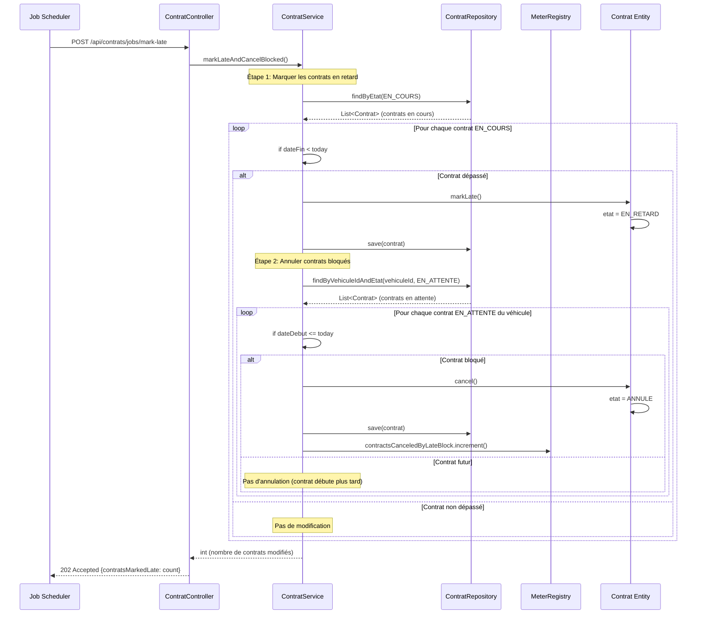

# Diagramme de Séquence - Job Mark Late

Ce diagramme illustre le fonctionnement du job `markLateAndCancelBlocked()`.

## Logique métier

### Étape 1 : Marquer en retard
- Récupère tous les contrats `EN_COURS`
- Pour chacun, vérifie si `dateFin < aujourd'hui`
- Si oui : transition `EN_COURS` → `EN_RETARD`

### Étape 2 : Annuler les bloqués
- Pour chaque contrat passé en `EN_RETARD`
- Récupère les contrats `EN_ATTENTE` du même véhicule
- Annule ceux dont `dateDebut <= aujourd'hui` (considérés comme bloqués)
- Les contrats avec `dateDebut > aujourd'hui` restent inchangés (futurs)

### Métriques
- Incrémente `contracts.canceled.byLateBlock` pour chaque annulation

## Idempotence
Le job peut être exécuté plusieurs fois sans effet de bord :
- Un contrat déjà `EN_RETARD` ne sera pas retraité
- Un contrat déjà `ANNULE` ne peut plus être modifié
