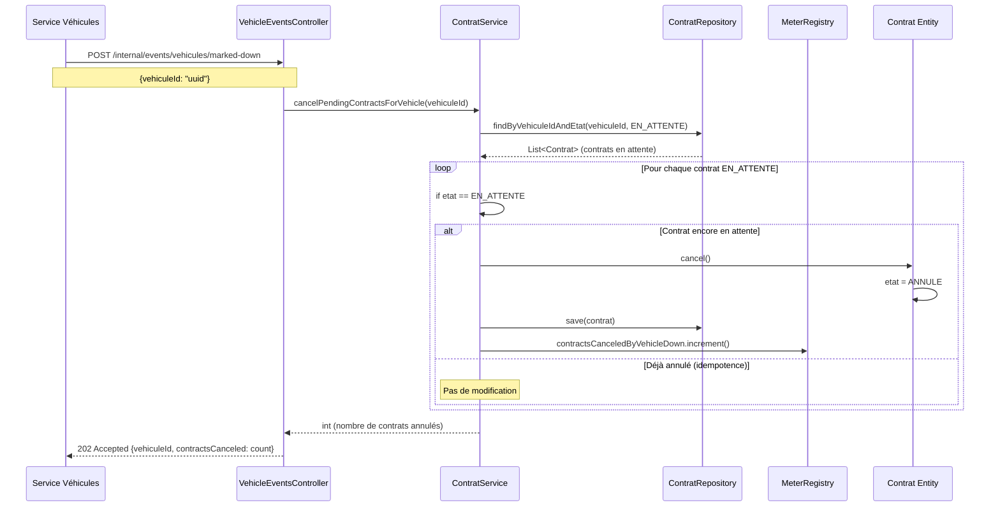

# Diagramme de Séquence - Vehicle Down Event

Ce diagramme illustre le traitement de l'événement "véhicule en panne".

## Logique métier

### Trigger
L'événement est déclenché par le service de gestion des véhicules lorsqu'un véhicule passe en état `EN_PANNE`.

### Traitement
1. Récupère tous les contrats `EN_ATTENTE` du véhicule concerné
2. Pour chaque contrat : transition `EN_ATTENTE` → `ANNULE`
3. Les contrats `EN_COURS` ou `EN_RETARD` ne sont PAS annulés (le client utilise déjà le véhicule)

### Métriques
- Incrémente `contracts.canceled.byVehicleDown` pour chaque annulation

## Règles de gestion

### Pourquoi seulement EN_ATTENTE ?
- **EN_ATTENTE** : Contrat futur → annulation possible sans impact client
- **EN_COURS** : Contrat actif → le client a déjà le véhicule, on ne peut pas l'annuler
- **EN_RETARD** : Contrat actif en retard → même logique que EN_COURS
- **TERMINE / ANNULE** : États terminaux → pas de modification

### Idempotence
- Vérification `if etat == EN_ATTENTE` avant annulation
- Si le contrat a déjà été annulé (double appel), pas de modification

### API Interne
L'endpoint `/internal/events/vehicules/marked-down` est destiné à une communication inter-services et n'est pas exposé publiquement via Swagger (tag "Internal").
